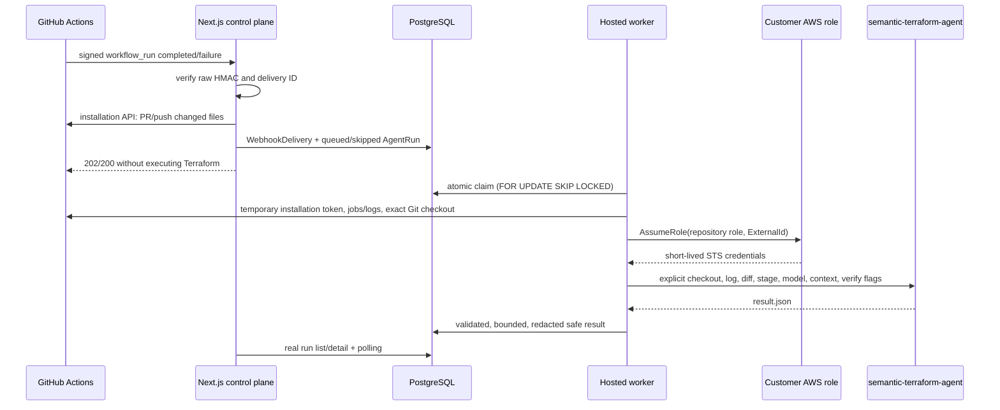

# Hosted agent execution

TerraFix turns a failed, configured GitHub Actions Terraform workflow into a durable hosted `AgentRun`. It does not require a repository-level TerraFix workflow or repository model/AWS secrets.



## Event and readiness rules

Only `workflow_run` with `action=completed` and `conclusion=failure` may queue execution. The workflow name must match the repository's exact names or safe wildcard patterns, and at least one changed path must match a Terraform path pattern.

The repository must have:

- an active GitHub installation and current repository grant
- saved configuration with the agent enabled
- a valid server-enforced model policy and eligible catalog model
- the relevant pull-request or push trigger enabled
- a connected AWS role

The control plane records explicit skip reasons including `workflow_not_configured`, `not_terraform_change`, `repository_not_ready`, `trigger_disabled`, and `fork_pr_untrusted`. `pull_request`, `push`, and `check_run` deliveries are stored as bounded audit outcomes but never directly invoke the model.

## Webhook trust and idempotency

`/api/github/webhooks` reads the request body as bytes, verifies `X-Hub-Signature-256` with HMAC-SHA256 and a timing-safe comparison, then parses JSON. `X-GitHub-Delivery` has a database unique constraint. A valid retry of the same delivery returns success without another `AgentRun`.

Only delivery ID, event, action, repository relation, outcome, skip reason, and timestamps are retained. Full webhook payloads are not stored.

## Evidence collection

The worker uses a short-lived installation token to list jobs for the failed workflow run and download failed job logs from GitHub's Actions API. It prefers Terraform/infrastructure/plan/validate job or failed-step names, strips terminal color sequences, selects bounded context around Terraform/error signals, and caps downloads/excerpts. It does not scrape GitHub HTML or send an entire workflow archive to the model by default.

If no bounded Terraform validate/plan failure is found, the claimed run becomes `skipped` with `not_terraform_failure`.

## Queue and worker

The queue is PostgreSQL-backed: `AgentRun.status=QUEUED`. A worker claims the oldest row with one atomic update over `SELECT ... FOR UPDATE SKIP LOCKED`, setting `RUNNING`, `workerId`, claim/start timestamps, and an initial heartbeat. A second worker cannot claim that row. Progress stages and heartbeats make active work diagnosable. Expired claims are changed to a bounded `worker_stale` failure; they are not executed again automatically. The MVP deliberately has no Redis and no automatic infrastructure retry loop.

`worker/Dockerfile` pins:

- Node 22
- Terraform 1.15.7
- `semantic-terraform-agent` v1.1.4 at commit `9caaef384897387afe0d8b7a2186b96bd968021e`

The Python agent remains the source of truth. The Node worker is orchestration glue only.

## Checkout, diff, and credentials

Each job gets a new temporary directory. The worker uses a token-free GitHub remote URL and supplies the installation token through an ephemeral Git configuration environment. It fetches/checks out the exact failing commit and removes the remote before agent execution.

- PR comparison: API-resolved base SHA to head/failing SHA
- push comparison: parent/before context to failing SHA, with a recorded local-parent fallback when necessary

The verified repository role is assumed with its unique External ID for a 15-minute STS session. Caller account and assumed role are verified before credentials are passed to the child. The service-owned `OPENROUTER_API_KEY` (plus optional legacy `GEMINI_API_KEY`) and temporary AWS values are allowlisted into the child environment. Database and GitHub App secrets are not forwarded.

The worker never persists installation tokens, STS credentials, or the Gemini key, and never puts a token in a clone URL or logs.

## Agent invocation and outcomes

The worker invokes the CLI without a shell:

```text
semantic-terraform-agent diagnose
  --repo-path <exact disposable checkout>
  --terraform-dir <saved directory>
  --log-file <bounded failure evidence>
  --diff-file <explicit base-to-head diff>
  --failed-stage <validate|plan>
  --provider openrouter
  --model-routing <auto|fixed>
  --max-model-tier <saved policy maximum>
  --model-registry <bounded snapshotted registry, auto only>
  --model <saved allowed model, fixed only>
  --context-mode <saved mode>
  --verify-patch
  --max-repair-attempts <0|1>
  --output <temporary result.json>
```

The worker verifies that the installed Terraform CLI exactly matches the saved repository version before invocation. The default complete-job deadline is ten minutes and covers GitHub evidence collection, checkout, AWS role assumption, agent execution, and safe result ingestion. GitHub requests and child processes also have operation-level timeouts. Deadline expiry aborts child work and records `execution_timeout`; an orphaned claim discovered after the deadline plus grace period records `worker_stale`. Other bounded error codes include `github_log_unavailable`, `github_checkout_failed`, `repository_access_removed`, `aws_assume_role_failed`, `terraform_not_found`, `terraform_version_unavailable`, `agent_execution_failed`, `agent_result_invalid`, `model_unavailable`, and `worker_internal_error`.

An agent result is schema-validated. Semantic Terraform Agent v1.1.4 usage,
verified-patch provenance, mutation eligibility level, and deterministic
`verification_assessment` are normalized into nullable `AgentRun` fields. The
assessment distinguishes `fully_verified`, `environment_blocked`,
`semantic_failure`, `patch_invalid`, and `unknown_failure`; only bounded,
redacted plan classification/reason/source metadata is retained. The canonical
patch is preserved byte-for-byte in a private worker field while UI/PR rendering
uses its redacted display copy. Raw plan/log output, prompts, full repository
source, full provider schema, Terraform state/provider cache, environment data,
and credentials are excluded.

Older results remain valid. Missing assessment fields stay `null`; existing
v1.1.0-v1.1.3 fully verified artifacts retain the Phase 11 path, but never gain
conditional eligibility. An explicit provider cost of `0.0` remains zero. The
dashboard never turns absent telemetry into a free run.

`AgentRun.status` describes orchestration (`queued`, `running`, `completed`, `failed`, `skipped`). `verificationStatus` separately describes patch verification. A valid but unverified diagnosis is `completed`, not a worker failure.

## Local end-to-end test

1. Use a separate private test repository with an ordinary GitHub Actions workflow that runs Terraform `init`, `validate`, and/or `plan` and retains Actions logs.
2. Register/update the development GitHub App using [github-app-setup.md](github-app-setup.md), including Actions read, Contents write, Pull requests write, Metadata read, and the sole Workflow run event.
3. Expose `http://localhost:3000/api/github/webhooks` through a trusted HTTPS tunnel. Put the public `/api/github/webhooks` URL and the same random `GITHUB_WEBHOOK_SECRET` in the App settings and `.env`.
4. Sign in, install the App on only the test repository, and approve any permission update.
5. Save repository configuration. Match the exact workflow name, enable the PR trigger, include `**/*.tf`/`**/*.tf.json`, and choose the expected failed stage.
6. Complete AWS onboarding with a least-privilege test role and confirm the repository is **Ready**.
7. Put the hosted service OpenRouter key in the worker environment. Do not add it to GitHub.
8. Apply migrations and run the dashboard plus worker:

   ```bash
   pnpm prisma migrate deploy
   pnpm dev
   pnpm worker
   ```

9. Open a branch in the same repository (not a fork), change a Terraform file, and create a semantic validation/plan failure. Open/update a PR so the existing Terraform workflow fails.
10. In GitHub App settings, confirm the `workflow_run` delivery received a `202` queued or `200` recorded response.
11. Open **Runs**. Confirm the row transitions from Queued to Running to Completed, then inspect diagnosis, suggested diff, attempt stages, timing, and tokens.
12. Correct the failure and confirm successful workflow runs do not create new agent executions.

For a container worker, run the documented image with server/worker secrets injected by the deployment environment. Do not bake `.env` into the image.

## Safety and current limitations

- fork PRs are always skipped before AWS role assumption; `pull_request_target` is not a bypass
- diagnosis never commits or pushes; a separate approved PatchApplication may create one non-force source commit, but never merges or mutates infrastructure
- no automatic worker retry and no more than one agent repair attempt
- job logs must still be available through GitHub Actions retention
- a configured workflow failure is required; the dashboard does not replace the repository's Terraform CI
- PR publication is documented separately in [pr-publication.md](pr-publication.md)
